# 🚀 Atelier Lambda Architecture avec Spark, Kafka et Hadoop

## 📋 Table des matières

- [Introduction](#introduction)
- [Architecture](#architecture)
- [Structure du projet](#structure-du-projet)
- [Installation](#installation)
- [Utilisation](#utilisation)
  - [1. Batch Layer](#1-batch-layer)
  - [2. Speed Layer (Streaming)](#2-speed-layer-streaming)
  - [3. Serving Layer](#3-serving-layer)
- [Commandes utiles](#commandes-utiles)
- [Troubleshooting](#troubleshooting)

---

##  Introduction

Cet atelier implémente une **Lambda Architecture** complète avec :
- **Batch Layer** : Traitement de données historiques avec Spark et HDFS
- **Speed Layer** : Traitement temps réel avec Spark Streaming et Kafka
- **Serving Layer** : Fusion des vues Batch et Streaming

### Technologies utilisées

- **Apache Spark** : Traitement distribué (batch et streaming)
- **Apache Kafka** : Streaming de messages en temps réel
- **Apache Hadoop (HDFS)** : Stockage distribué
- **Docker** : Conteneurisation de l'infrastructure

---

##  Architecture

```
                    Lambda Architecture
                    
┌─────────────────────────────────────────────────────────┐
│                                                         │
│  Données Historiques          Données Temps Réel       │
│         ↓                              ↓                │
│   ┌──────────┐                  ┌──────────┐           │
│   │  HDFS    │                  │  Kafka   │           │
│   └────┬─────┘                  └────┬─────┘           │
│        ↓                              ↓                 │
│   ┌──────────┐                  ┌──────────┐           │
│   │  Batch   │                  │ Speed    │           │
│   │  Layer   │                  │ Layer    │           │
│   │  (Spark) │                  │ (Spark)  │           │
│   └────┬─────┘                  └────┬─────┘           │
│        ↓                              ↓                 │
│        └──────────┬───────────────────┘                │
│                   ↓                                     │
│            ┌──────────────┐                            │
│            │   Serving    │                            │
│            │    Layer     │                            │
│            └──────────────┘                            │
│                                                         │
└─────────────────────────────────────────────────────────┘
```

---


##  Structure du projet

```
atelier-lambda/
├── docker-compose.yml          # Configuration des conteneurs
├── config                      # Configuration Hadoop/YARN
├── README.md                   # Ce fichier
├── app/
│   ├── datasets/
│   │   └── transactions.json   # Dataset batch
│   ├── batch_job.py           # Job Spark batch
│   ├── streaming_job.py       # Job Spark streaming
│   └── serving_layer.py       # Fusion batch + streaming
└── volumes/
    └── namenode/              # Données HDFS (généré automatiquement)
```

---

##  Installation

### 1. Cloner ou créer le projet

```powershell
mkdir atelier-lambda
cd atelier-lambda
```

### 2. Créer la structure des dossiers

```powershell
mkdir app
mkdir app\datasets
mkdir volumes
```

### 3. Créer les fichiers nécessaires

#### `docker-compose.yml`

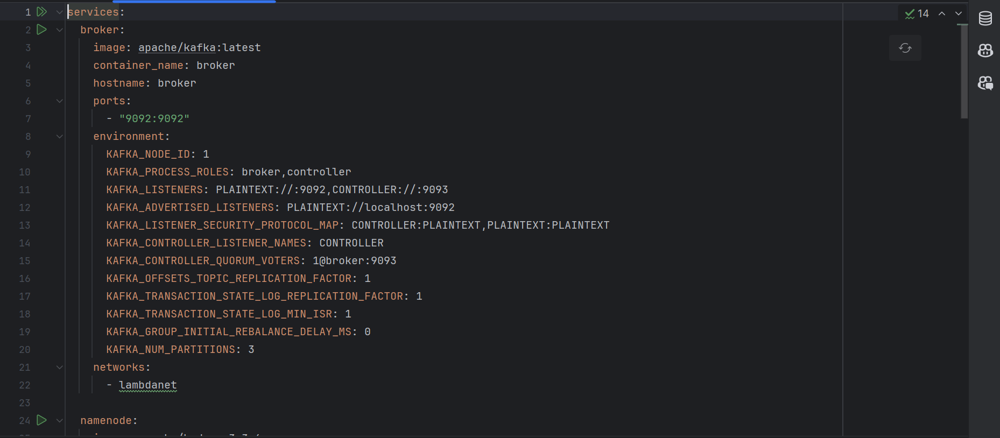

#### `config`
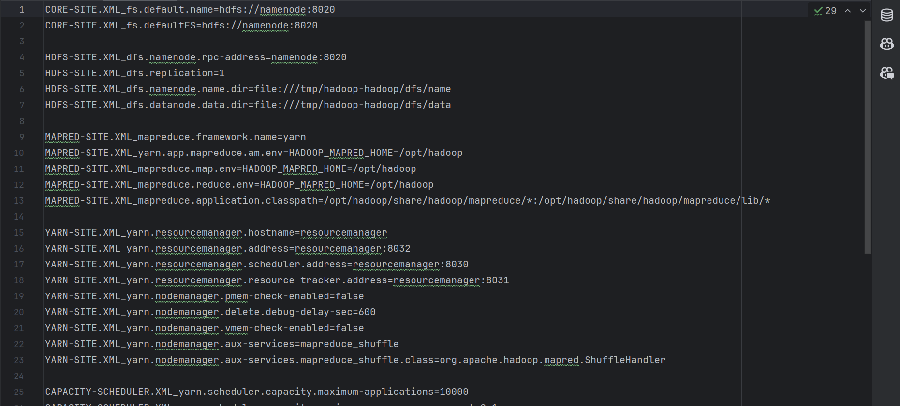


#### `app/datasets/transactions.json`
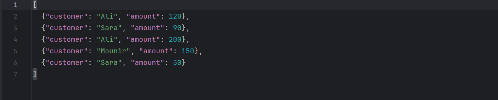


#### `app/batch_job.py`
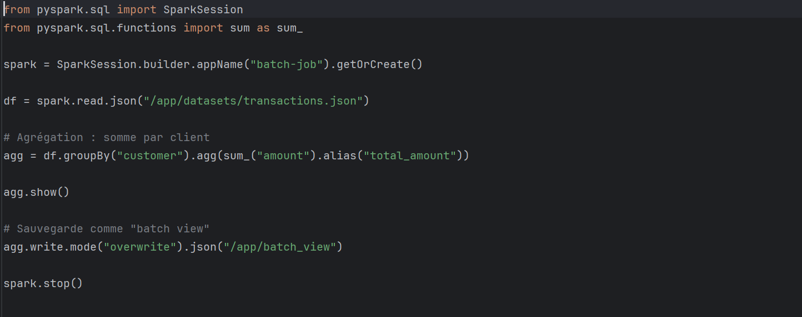

#### `app/streaming_job.py`
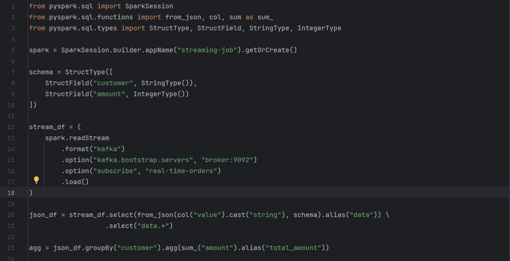

#### `app/serving_layer.py`
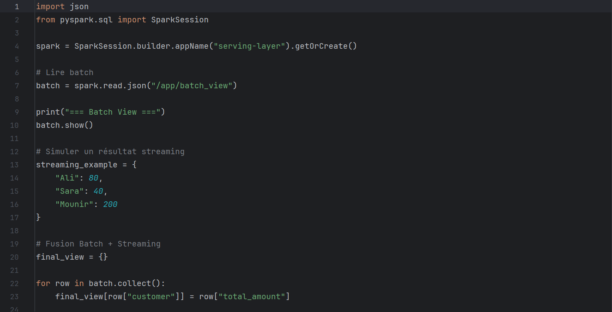

### 4. Démarrer l'infrastructure

```powershell
docker-compose up -d
```
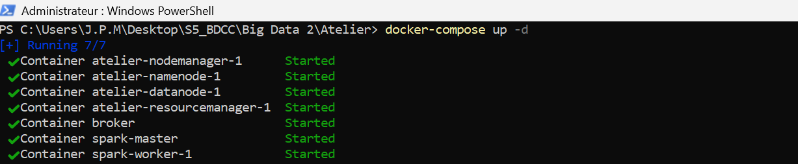

### 5. Vérifier que tous les conteneurs sont démarrés

```powershell
docker ps
```
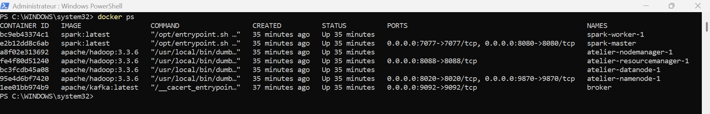


##  Utilisation

### 1. Batch Layer

#### Exécuter le job batch

```powershell
docker exec -it spark-master /opt/spark/bin/spark-submit /app/batch_job.py
```
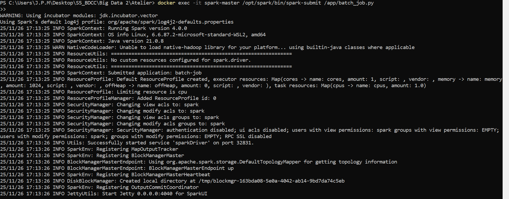

#### Résultat attendu
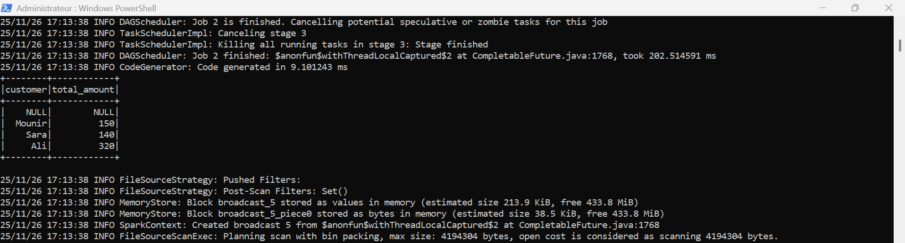


Les résultats sont sauvegardés dans `/app/batch_view`

#### Vérifier les fichiers générés

```powershell
docker exec -it spark-master ls -la /app/batch_view
```
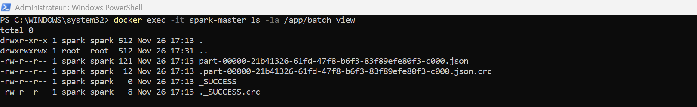
---

### 2. Speed Layer (Streaming)

#### Étape 1 : Créer le topic Kafka

```powershell
docker exec broker /opt/kafka/bin/kafka-topics.sh --create --topic real-time-orders --bootstrap-server broker:9092 --partitions 3 --replication-factor 1
```
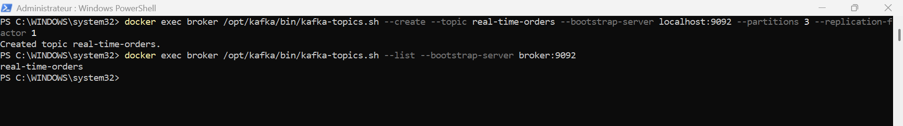

#### Étape 2 : Lancer le job Spark Streaming

```powershell
docker exec -it spark-master /opt/spark/bin/spark-submit --packages org.apache.spark:spark-sql-kafka-0-10_2.12:3.5.0 /app/streaming_job.py
```
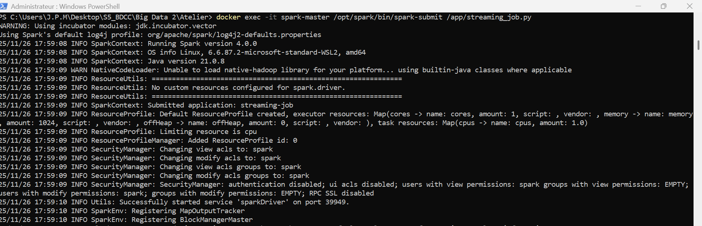

#### Étape 3 : Dans un AUTRE terminal, lancer le producteur Kafka

```powershell
docker exec -it broker /opt/kafka/bin/kafka-console-producer.sh --topic real-time-orders --bootstrap-server broker:9092
```
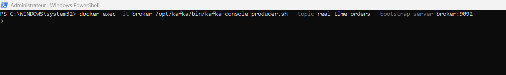

#### Étape 4 : Envoyer des messages

Dans le producteur Kafka, tapez ces messages :
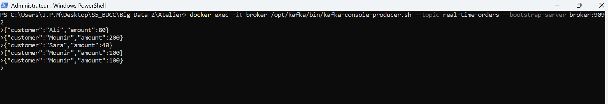


#### Résultat attendu

Dans le terminal du Spark Streaming, vous verrez les agrégations en temps réel :


---

### 3. Serving Layer

#### Fusionner les vues Batch et Streaming

```powershell
docker exec -it spark-master /opt/spark/bin/spark-submit /app/serving_layer.py
```
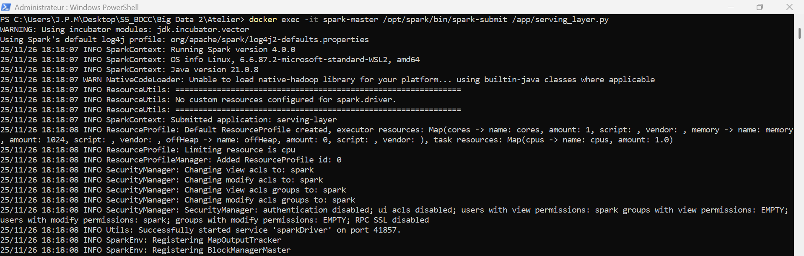

#### Résultat attendu
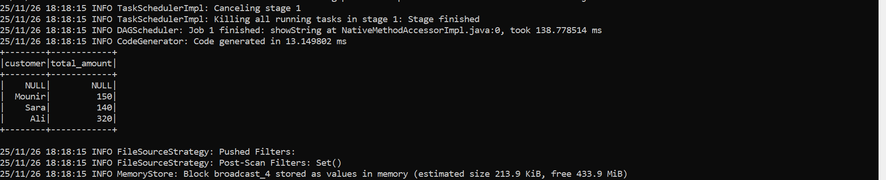
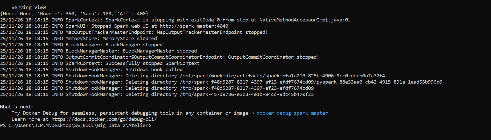


#### Vérifier le fichier JSON généré

```powershell
docker exec -it spark-master cat /app/serving_view.json
```
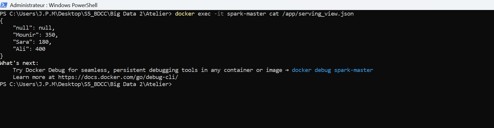
---


